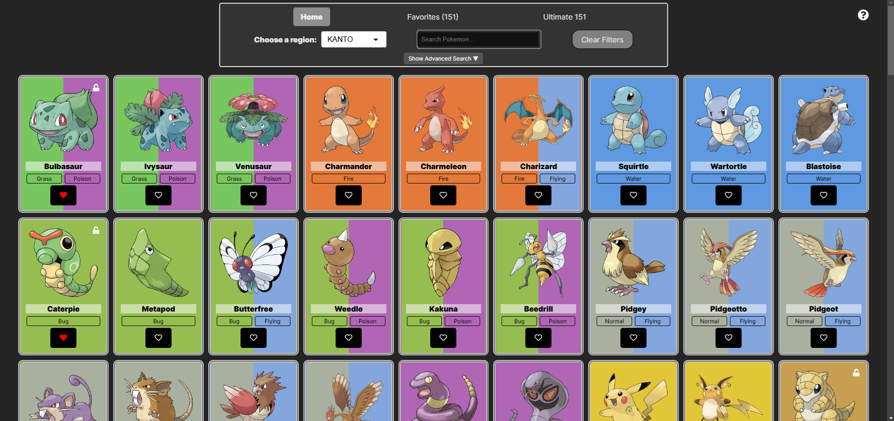

# Pokedex App

A simple Pokedex application built with React, React Query, Redux Toolkit, React Router, and Dexie.js for persistent data.

## Screenshots



## Features

* **Browse Pokemon:** View a paginated list of Pokemon, fetched from the PokeAPI.
* **Search Pokemon:** Filter the Pokemon list by name (case-insensitive).
* **Pokemon Details:** View detailed information about each Pokemon.
* **Favorites:** Add and remove Pokemon from your favorites list, persisted locally using Dexie.js.
* **Navigation:** Seamless navigation between Home, Favorites, and Pokemon Details pages.
* **Loading and Error Handling:** Clear visual feedback during data loading and error states.
* **Responsive Design:** Works well on different screen sizes.

## Technologies Used

* **React:** A JavaScript library for building user interfaces.
* **React Query:** A powerful data-fetching and state management library for React, used to handle asynchronous data fetching, caching, and background updates from the PokeAPI.
* **Redux Toolkit:** A set of tools that simplify Redux development, used for managing application state related to UI interactions and user preferences (like favorites).
* **React Router:** A standard library for routing in React applications.
* **React Icons:** Easily include popular icons in your React projects.
* **Dexie.js:** A minimalist wrapper for IndexedDB, used for persistent storage of user's favorite Pokemon.

## State Management and Data Persistence

* **React Query:** Manages asynchronous state related to fetching Pokemon data from the PokeAPI, including caching and background updates.
* **Redux Toolkit:** Manages synchronous state, such as:
  * User's favorite Pokemon (acting as an in-memory cache).
  * Search term used to filter the Pokemon list.
  * Currently selected Pokemon for details view.
* **Dexie.js:** Provides persistent storage for the user's favorite Pokemon, ensuring that favorites are saved across page refreshes and browser restarts. The Redux store is initialized with data from Dexie on app load, and updates to favorites are synchronized between Redux and Dexie.

This combined approach provides optimal performance and a clean separation of concerns.

## Installation

1. Clone the repository:

    ```bash
    git clone [invalid URL removed]
    ```

2. Navigate to the project directory:

    ```bash
    cd your-repo-name
    ```

3. Install dependencies:

    ```bash
    npm install
    # or
    yarn install
    # or
    pnpm install
    ```

## Usage

1. Start the development server:

    ```bash
    npm start
    # or
    yarn start
    # or
    pnpm start
    ```

2. Open your browser and navigate to `http://localhost:5173`.

## License

MIT
